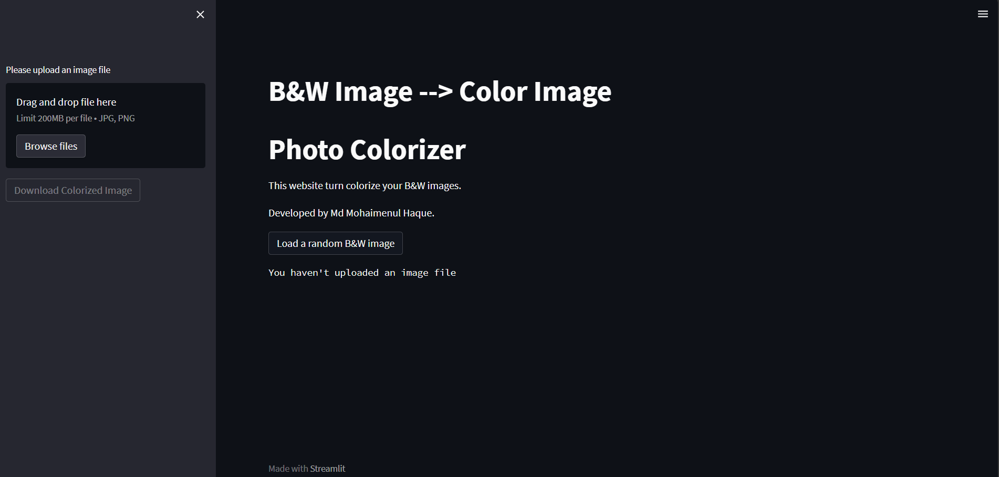
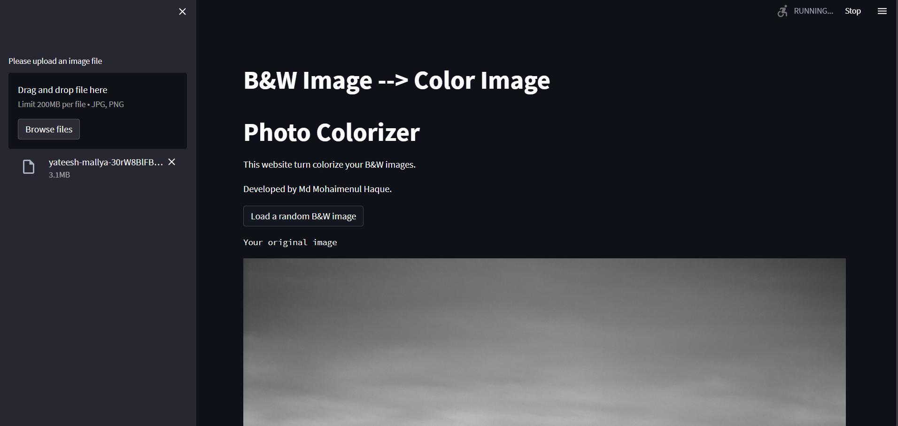

# Photo-Colorizer
Black and white image colorization with OpenCV.

# Overview
Image colorization is the process of taking an input grayscale (black and white) image and then producing an output colorized image that represents the semantic colors and tones of the input.

# Photo Colorizer App

# Motivation
When I learned linear algebra and came to know about how the machine inteprets pictures as tensors and concept of image segmentation. I remember there were some movies which was restored and picutured in theatre. I just came across Research papers of University of california in image colorization. And most iimportantly when I colorized photos of my Grandmother with gorgeous saree, that smile in my mother's face worth it.

